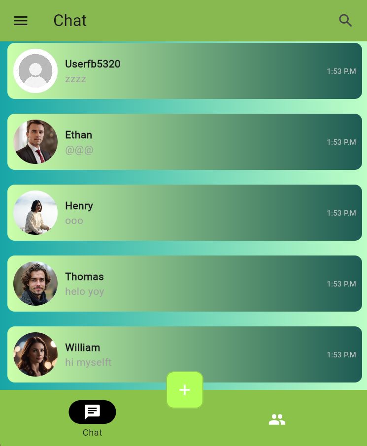
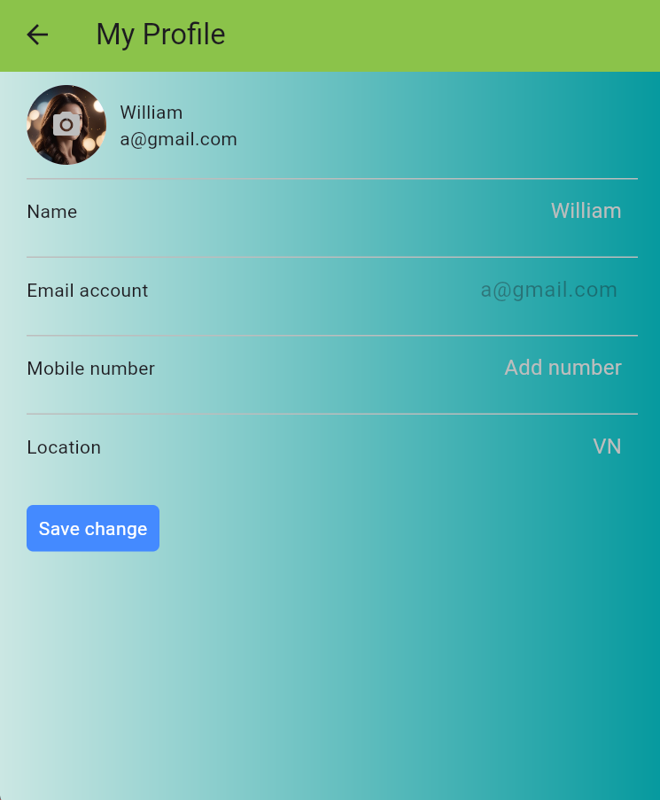

# Tylk_Chat
**"Tylk_Chat – Connect Your Way"**  
Tylk_Chat is a modern messaging app designed to help you connect with friends, family, and colleagues in a fast, convenient, and inspiring way.

**"Why Choose Tylk_Chat?"**
- #### Intuitive Interface: 
    A sleek and user-friendly design makes it easy to navigate from the very first use.
- #### Instant Interaction: 
    Send messages in real-time with lightning-fast WebSocket technology.
- #### Lightweight and Fast: 
    Optimized for smooth performance even on low-end devices.


## Key Features 

### 1. **Chats** 
- Chat real-time with WebSocket.
- Chat one - one.
- Add new chat section.
- Find user in chat.

### 2. **Add Friends**
- Add one or more people at the same time.

### 3. **User Account Management**  
- Sign up, log in and fortgot account via email.

### 4. **Personalized Notifications** 
- Send notifications about new friends. 

## Technology Stack  

### 1. **Frontend**  
- **Flutter**: A cross-platform framework for developing smooth and intuitive user interfaces.  

### 2. **Backend**  
- **NodeJS(Express)**:  
  - **Authentication**  
  - **Websocket**
  - **JWT**
  - **MongoDB**
- [Tylk_Chat_Backend](https://github.com/thienkk25/Tylk_Chat_Backend.git)

### 3. **API Integration**  
- **RESTful API**: Connect with external services or custom backend features.  
- **Http (Flutter)**: Libraries for making HTTP requests.  

### 4. **State Management**  
- **Riverpod**: Efficiently manage application state.

## Installation and Deployment  
1. Clone the repository:  
   ```bash  
   git clone https://github.com/thienkk25/Tylk_Chat.git  
   ```
2. Install dependencies:
    After cloning the repository, open the project folder in Visual Studio Code or IDE and run the following command to install the dependencies:
    ```bash  
   flutter pub get
   ```
## Project results

# Image:
         